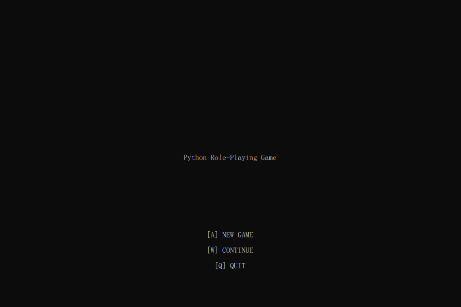
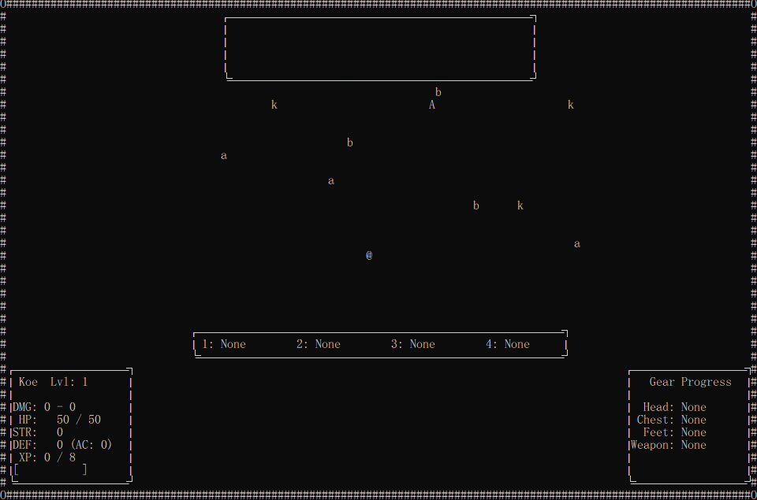
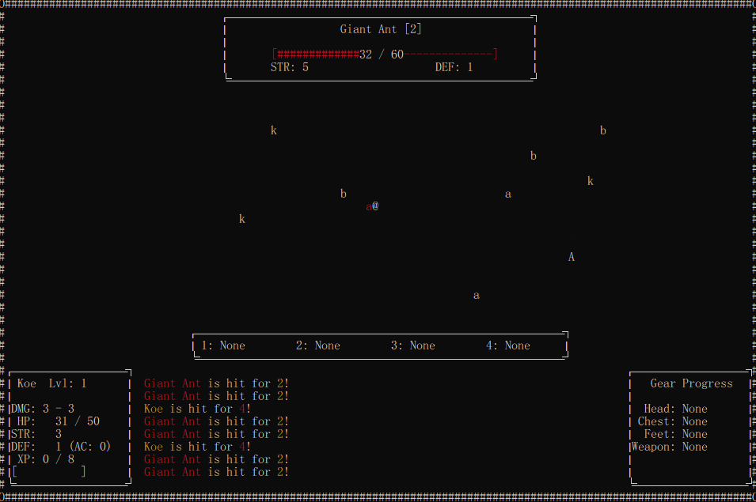
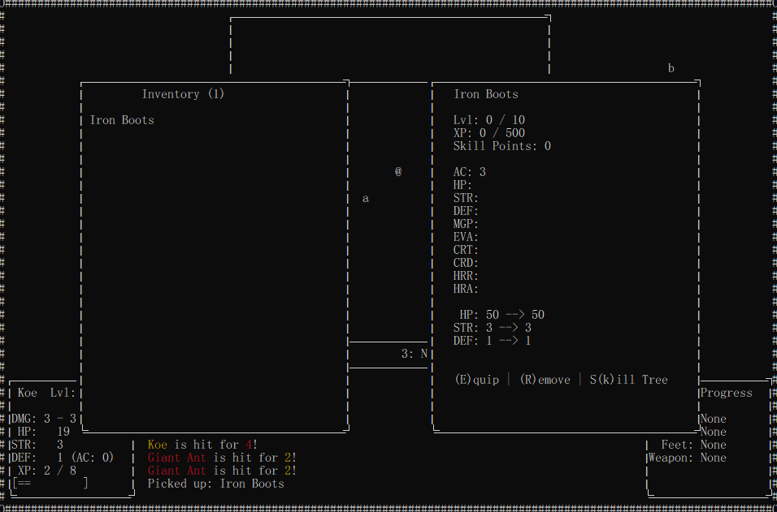
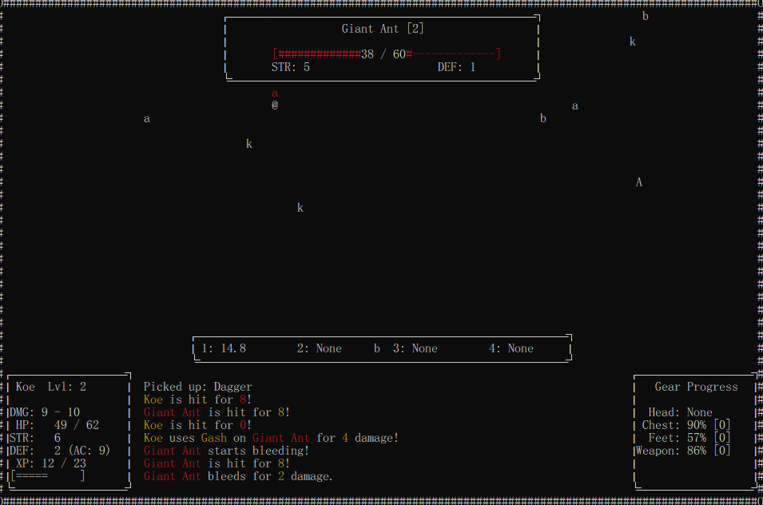
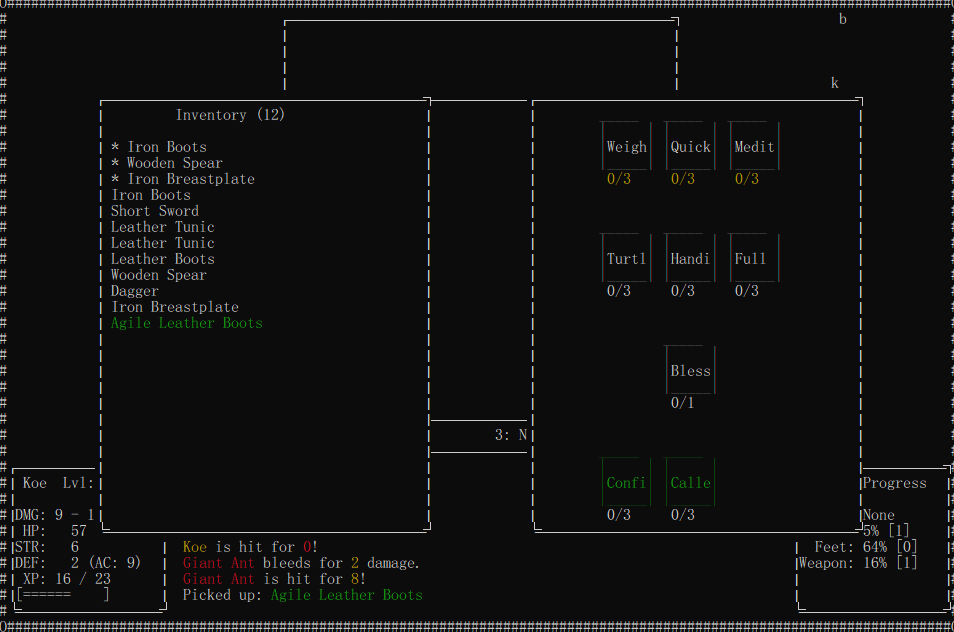

# Python Role-Playing Game

## About

This is a terminal-based role-playing game developed with Python's `curses` library. Development started in February with a goal of committing at least once a day. After nearly eight months, the game is ready for a small demo. Development is ongoing, so expect occasional bugs or crashes. More content will be added over time.

## Features

- Real-time auto-attack combat
- Scrolling combat log with a 200-message history
- Scaling UI (still buggy)
- Procedurally generated equipment
- Item rarity and affix systems
- Equipment leveling and branching equipment skill trees
- Active and passive abilities
- Critical hits, evasion, and defense
- Damage bonuses against enemy species
- Character saves and inventory

## Controls

Keyboard and mouse are currently required.

| Input                         | Action                                                                         |
|-------------------------------|--------------------------------------------------------------------------------|
| W, A, S, D                    | Move                                                                           |
| Q                             | Return to the previous menu; save and quit when outside menus                  |
| I                             | Open inventory                                                                 |
| Left click an enemy           | Target it; the target turns red. You must target an enemy before attacking it. |
| Left click an inventory item  | View its description; additional controls appear in that window.               |
| Right click an inventory item | Remove the item from your inventory.                                           |
| Left click a skill tree node  | View its details; additional controls appear there.                            |

## Installation

Download the demo from the repository's **Releases** page when a build is available. Follow the instructions included with that release.

## Screenshots

### Gameplay and combat

### Inventory and progression

## Roadmap

1. Add more skill tree nodes, layouts, enemies, and abilities.
2. Create environments and maps.
3. Balance gameplay.
4. Fix bugs and polish the demo.

## Known Issues

- Resizing the window can crash the game. Try to avoid resizing it while playing. Full-screen mode should work.
